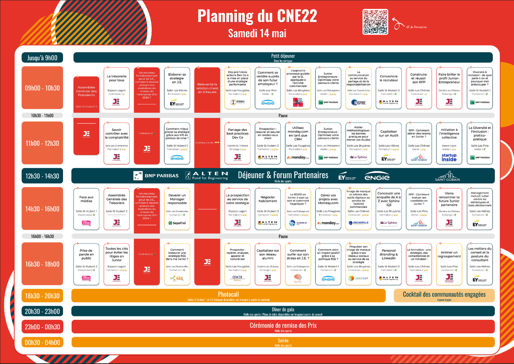

# CNE 2022

## La formation : une stratégie, des compétences et un mindset - CNJE

Formation : quelle cible

Parallèle avec pédagogie => procédés pour instruire et former des enfants
Enfants : curiosité = mindset

Méthodes pédagogiques :
- Affirmative = classique
- démonstrative = recette de cuisine
- interrogative = challenger qqn
- heuristique
- experientielle = notre exp en junior

Pyramide apprentissage, on retient
Passif
- 5% de ce que l'on suit
- 10% de ce qu'on lit
- 20% voir + entendre
- 30% démontré
Actif
- 50% échange 
- 70% fait
- 90% enseigne

Enjeux de la formation
Business
- adapter ses compétences
- dev son activité
- rép aux besoins client
RH
- pérenniser la structure
- faire evo la structure
Individu
- vive exp en montant en compétence
- diversifier son profile

Comment mettre en place une strat de formation pré rfp pour commencer mandat sereinement

Préparer forma à l'avance
QS, pistes d'amélioration, retours d'expérience

Identifier missions et compétences
= Fiche de poste

4 étapes 
- analyse du besoin en compétences
Bilan de l'ensemble des compétences actuelles pour tous postes
Suffisant pour stratégie ?
Modification organigramme, postes en fonction des réponses
- constats
Y a-t-il un QS, retours d'expérience
- tableau de suivi
Avec toutes les formations : identifié qui a besoin de quelles formations
Déterminer date des formations, objectifs pédagogiques, format
- calendrier de formations

Onboarding
Welcome kit
- fiches de poste
- Book de passation
- formations obligatoires
- outils de montée de compétences

Outil de formation et passation
- assez générique au niveau du poste
- plan de développement de compétences
Sur mesure pour le membre concerné
CR d'un entretien abordant le développement de compétences
Prioriser les compétences
- plan de développement de compétences post rfp
CR entretien avec le développement de compétences
Analyse de la feuille précédente
Priorisation des compétences à dev et par quels moyens
Déterminer les nouvelles compétences à assimiler

Certifications, sur le CV, "je perds pas mon temps même si ça m'intéresse pas" 

