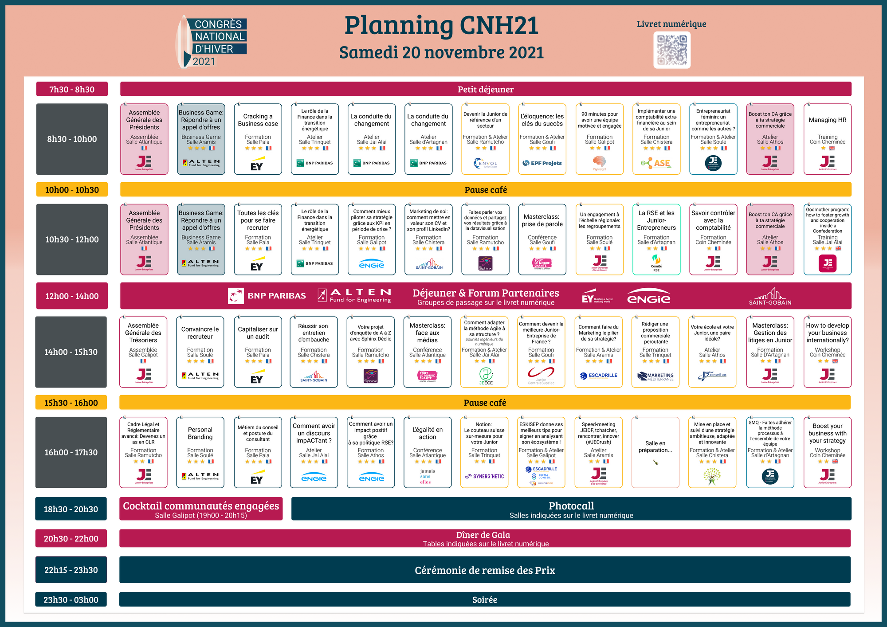

# CNH 2021

## JEECE : Comment adapter la méthode agile à sa structure

Paul & Cléo

### Ice Breaker

SCRUM / KANBAN impossibles dans école d'ingé classique (possible à 42 ?)
(Sprint de 1/2 semaines)

Fonctionnement itératif => établit besoins, réalise phase de developpement, on recup retours du client, et on adapte le livrable final

Avantages de l'agilité

+ | -
--| --
Paiement échelonné | Parfois compliqué à vendre car devis initial sur la proposition commerciale approximatif **(10% de marge)**
Cahier des charges découpé |
Rendus fonctionnels à chaque BC |
Retours utilisateurs possibles |
1 seule CCa à signer sur 3 ans |

10% de marge

+ | -
--|---
Cahier des charges découpé et donc évolutif | Parfois compliqué à vendre car devis de la proposition commerciale approximatif (10% de marge)
Moins danger pour la structure | Le client peut décider d'arrêter l'étude en cours
Possibilité de prendre des études beaucoup plus ambitieuses | 
Devis plus précis (Moins de perte d'argent et de temps) |
Développement de bons de commande en parallèle possible |
Passation des missions lors des changements de mandats plus faciles |

Exemple

SII Learning (apprentissage en ligne)

ERP, projet énorme, demandaient un projet "Step by Step", a permit à JEECE de tester l'agilité (très peu utilisée en JE à l'epoque / pas du tout)

Facteur déterminant, ils ont prit JEECE pour leur capacité itérative

Paiement échelonné et phase de test réalisée par les intervenants

11 semaine, 4 semaines, ...

budget => pas plus de 2000

Tendre vers le 1 mois ça serait cool

Planning prévisionnel dans propale pas tjrs maintenu chez jeece mais budget souvent proche de la propale

JEECE fait acompte à chaque fois

Questionnaire satisfaction apres chaque BC pour JEECE

BC parallèles arrive souvent chez jeece, tu gagnes du temps

But : baisser temps entre fin BC et début BC prochain

Moyenne entre BC -> 2 semaines

CCa :
- Methodologie type et objectif du livrable
- Contexte de la relation Junior/Client
- CGU

BC:
- Phases à réaliser / CDC
- Devis / Planning

Idéation / Maquettage => vendu à chaque fois quasi

methodo plus précise dans bc si besoin

methodo dans cca : très vague / change pas entre les projets

Fidélisation
- signe document valable pdt lgtmps
- pas besoin
- la junior parait plus disponible et permet egalement de pallier l'absence de maintenance en Junior

> "marié avec le client"

VRAI AGILE : 20/25% du temps du sprint
(=> 4 j?)

