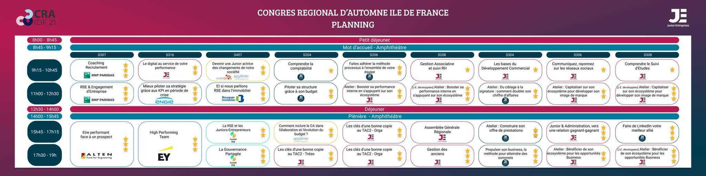

# CRA IDF 2021 Ateliers

## Atelier coaching recrutement

### Le CV

Marge => spécialité, compétences, outils, langues, centre interet, coordonnées,
école, expériences précédentes (pas détailler si pas interessant pour le poste)

En dessous du titre, introduction de toi très rapide

> "La vérité peut être montrée de manière différente"

Phoning => "Participer activement au développement commercial ..."

### Lettre de motivation

**En développeur** => useless

Dépend du secteur d'activité donc

Doit être succinct => ~10 lignes

### Junior

Nombre de mission sur le mandat, CA. Parler d'Agile ? Formation des CDP

Recrutement, tests techniques qu'on a fait. Chiffrage, budgetage ...

KPI, stratégie, commercial

### Autre

Prendre des infos sur le pays (ex : UK, CV se fait sur deux pages)

**Question** : Comment va-t-on évaluer votre capacité à communiquer ?
Parlez-moi d'une réunion ou d'une présentation que vous avez animée.
Quel moyen avez-vous utilisé pour être efficace dans votre communication pendant la réunion ?

**Question** : Capacité d'adaptation. Prise de poste réussie dans un nouvel environnement de travail.

**Question** : Rigueur et précision. Deadline + éviter les erreurs (rush)

**Question** : Qu'allez vous dès demain pouvoir mettre en place ? => Dans le nouveau boulot. Méthode de travail ?
