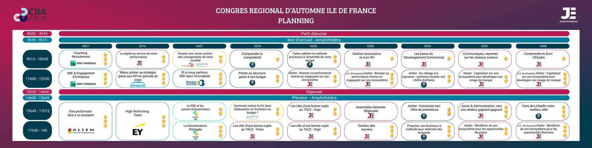

# CRA IDF 2021 Ateliers

## Mieux piloter sa stratégie grâce aux KPI en période de crise

### Ice Breaker

**Crise** : Qqc __qu'on a pas prévu__ au __plan d'action__
* Difficulté pour recruter des intervenants
* Litige - Contentieux

Crise = Interne OU Externe

### Analyser les mots

**Piloter sa stratégie** : plan d'action
> "La stratégie, c'est l'art de bien vivre avec ses concurrents, tout en développant son business !"

Être ambitieux ! Viser la lune

**KPI** :

*perf business* : CA / nbr études / délais avec clients / réclamations / satis client / KPI sur la sous,co traitance => **SATIS CLIENT**

*perf financière et opérationnel* : taux marge / rentabilité globale / Cash,trésorerie / Conformité / Délais sur les retous clients (factures, trésorerie) => **CASH**

*motiv et engagement des troupes* : satis intervenant / satis staff / turnovers VS rétention => **SATIS STAFF**

**Piloter Tréso** = toutes les semaines! / tous les jours si on est très gros

Exemple situation crise :
- Départ du président ou trésorier
- Client fidèle dépose le bilan
- Perte du soutien de l'école
- Moitié de l'effectif qui part...

### Méthode des 5 pourquoi

Outil de résolution de problème qui permet d'identifier les causes profondes d'un dysfonctionnement au sein de la structure

- KPI : CA en baisse
- Pourquoi?
- Moins de clients
- Pourquoi?
- Création d'une nouvelle junior dans domaine/ville
- Pourquoi?
- Offre un service qui répond mieux aux attentes des clients
- Pourquoi?
- Car la junior a travaillé sur son étude de marché / de son env et a prêté une attention particulière aux attentes ddes clients et enseignements efficacement des consommateurs

=> SWOT, appliquer les 5 pourquoi pour chaque item des menaces

### Analyse environnement : technique du The Ecosystem Canvas

### Diagramme d'Ishikawa

Outil de brainstorming pour passer des causes en catégorie
- Méthode
- Matière
- Matériel
- Milieu
- Main d'oeuvre

Ishikawa
1. Pointer l'effet
2. Dresser les causes
3. Repérer les causes sur lesquelles la junior peut agir
4. Hiérarchiser les causes

### Méthode QQOQCP

- Qui
- Quoi
- Où
- Quand
- Comment
- Pourquoi

=> Description complète du problème

### Atelier

Pour chaque problème, faire un plan de crise au préalable.

Perte du soutien de l'école

Perte de la moitié de l'effectif
