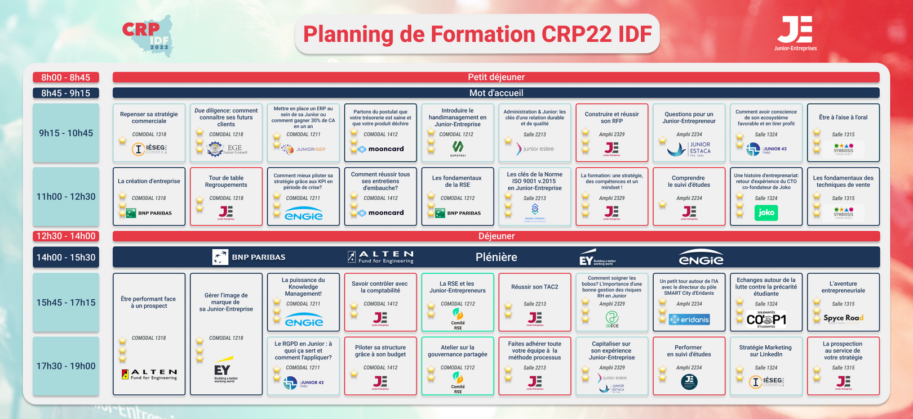

# CRP IDF 2022

## Mettre en place un ERP au sein de sa Junior ou comment gagner 30% de CA en un an

Par junior isep

### Ice breaker: les autres ils font quoi

GSuite, Notion, Google App Script

### ERP

Technologie :
- améliorer la culture de l'entreprise
- opposrtunité sur les processus
- ux

Performance :
- automatisation
- plus facile
- satisfaction client (plus efficace)

Automatiser les envois à signer
- Validation docs
- Audit de mission
- Archivage, ...
- Annuaire clients
- Suivi de mission, relances

Connecter des services différents, modulaire, adaptatif

SAP - abordable pour certaines JE

Centraliser données, formaliser processus, KPI, optimiser quand appeler les clients, gestion des roles, qualité

Appli JISEP JE-Intervenant

Nomenclature automatique, documents uniformes

Generation de boilerplate wordpress dans leur ERP

(note sur définition : API = un peu une secrétaire en fait)

Commentaires relecture sur ERP

Module pour chaque pôle

Process GANTT

SAGE / GSuite / Abys cyborg / Messenger / Audaxis / Teams

note perso: react admin?

1 an et demi d'idéation et réalisation pour leur version actuelle

Backups!!

Budget 400 euros à l'année, mais quand ajoute des serveurs, 15k

LXC

LDAP keycloak
