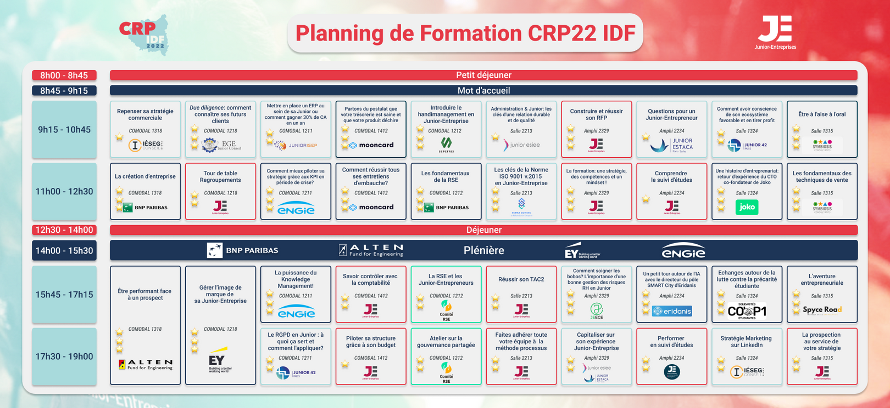

# CRP IDF 2022

## Une histoire d'entreprenariat : retour d'expérience du CTO et co-fondateur de Joko

Criteo : une licorne

Maths à polytechnique (informatique sous le prisme maths)

Corps des mines

Entreprenariat : ce qui compte c'est l'équipe fondatrice et pas l'idée /
Pas recruter quand un doute (ya un doute = ya pas de doute) /
Monter sa boite c'est un marathon pas un sprint /
...

Joko : app mobile, lancé en 2018, 12M levé, 1M users,
35 employés, parité h/f avec 6 fonctionalité, 28% full remote

Faire ses achats sur mobile c'est compliqué
- soit amazon, c'est simple
- sinon, trouver le meilleur prix = se réinscrire, donner info de paiement à bcp de sites, absence d'info sur origine

=> une des raisons pour laquelle amazon est si populaire

mais tout le monde aime pas amazon (distrust)

Approche : app de mobile, expérience amazon-like, être un navigateur pour l'ecommerce mobile

Navigateur custom! changer l'interface web des sites d'ecommerce

Algo de machine learning qui transforme le site vers une expérience meilleure

Features, trouver produit occasion, calcul emprunte carbon...

Comment on en est arrivé à là

Reglementation sur la donnée bancaire, droit à l'ouvrir à d'autres applis = DSP2

Principe american express sur les miles pour gagner un voyage => fidélisation

"Fake it until you make it" = pôt commun pour faire des pubs sur facebook, faire des tests de conversion sur des sites

Liste d'attente, effet de viralité sur la liste d'attente, les 100k premiers sont fake, et on peut inviter des gens sur la liste d'attente (= viralité)

Marché biface (comme airbnb, b2b et b2c), trouver des hacks pour ça

Recruter des amis pour coller des qr code sur des trotinettes pour grossir liste d'attente

Repéré par fond d'inverstissement, qui avant disait que c'était nul et après les a recontacté après la trotinette etc... (tout en full hacks)

Repéré par facebook, mouiller le maillot

Rentré dernier du batch, ressorti premier

Covid! sur internet, récompenses

Extension chrome, qui a explosé

Trouver des partenaires au début c'est hard. Affiliation

Livre : the hard things about hard things, bouquin de netflix : no rules rules
Podcast : dropout

Logique 10x sur les recrutements
